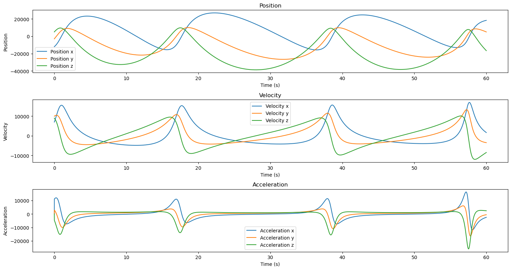
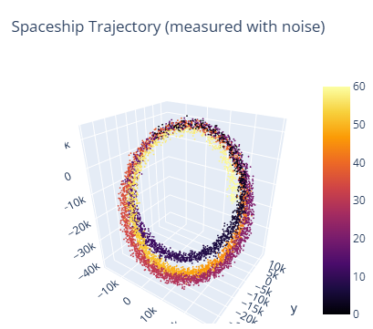
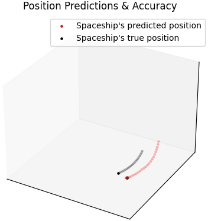
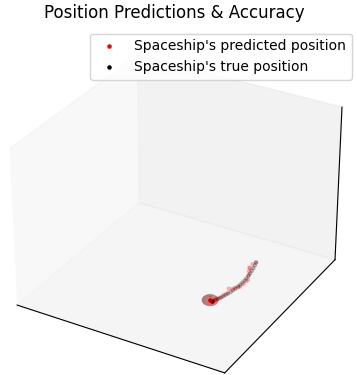

# DSIP Kalman Accuracy vs Uncertainty

This project simulates a spaceship gravitating around the moon in a dynamic non-linear system. The simulation introduces gravitational pull and synthetic noise to mimic real-world unpredictable external forces. 

The primary objective is to apply Kalman filter algorithms to estimate the true state (position, velocity, acceleration) of the spaceship from noisy measurements, effectively filtering out uncertainty and improving accuracy.

## Installation

1. Ensure Python 3 is installed.
2. Install the required dependencies using pip:
   ```bash
   pip install -r requirements.txt
   ```

## Running the Notebooks

The Jupyter notebooks are located in the root directory.

1. Open `01_Real_World_Simulation.ipynb` first to understand the mathematical/physical basis of the model and generate the initial datasets.
2. Open `02_Final_Presentation.ipynb` to see the Kalman filter logic in action, along with the generated comparative plots.
3. Execute the cells in each notebook sequentially.

> **Note**: The data outputs (like CSVs) will be generated in the `data/` directory, and video renderings in the `videos/` directory. Ensure you run the simulation notebook before the presentation notebook to generate the required data.


## Visualizing the Results

Here are some screenshots and plots generated by the notebooks showing the simulation and the application of the Kalman filter:

<div align="center">

### 1. Initial Simulation

<br />
<em>Initial mathematical model simulation of the spaceship's orbit.</em>

<br /><br />

### 2. Adding Real-World Noise

<br />
<em>Visualizing the original noisy orbit, approximating real-world tracking errors before applying the Kalman filter.</em>

<br /><br />

### 3. Applying the Kalman Filter (Model 1)

<br />
<em>Trajectory visualization showing the true state versus the noisy measurements and the Kalman filter estimates.</em>

<br /><br />

### 4. Advanced Refinement (Model 2)

<br />
<em>Further refinement and comparative analysis of different Kalman filtering approaches on the orbital data.</em>

</div>


## Project Structure

- `01_Real_World_Simulation.ipynb`: Contains the mathematical and physical basis of the simulation model. Generates the initial noisy orbital data.
- `02_Final_Presentation.ipynb`: Contains the Kalman filter implementation, applies it to the generated data, and produces the comparative results and visualizations.
- `docs/`: Documentation and extracted images/screenshots.
- `data/`: Output data (CSVs) generated by the notebooks.
- `videos/`: Video renderings of the orbit simulations.

Please refer to the `docs/docs.md` file for more detailed information.